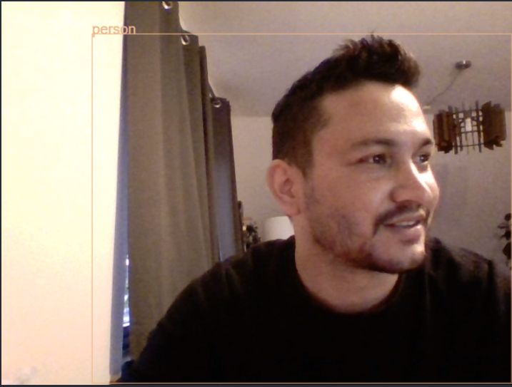

# Object Detection React App

This is a try to create an object detection react app. I used pretrained
 model available on tensorflow website. I used [Object Detection (coco-ssd)](https://www.npmjs.com/package/@tensorflow-models/coco-ssd)
 model trained on Coco dataset which is a large-scale object detection, 
 segmentation, and captioning dataset.The Pretrained model is capable of detecting 80 classes of objects. 

## Demo

## Setup
Install webcam component using.

`npm install react-webcam`

Install Tensoeflow.js using

`npm install @tensorflow/tfjs`

Install Pre-trained object detection model

`npm i @tensorflow-models/coco-ssd`

After everthing is Setup, start react server 

`npm start`

